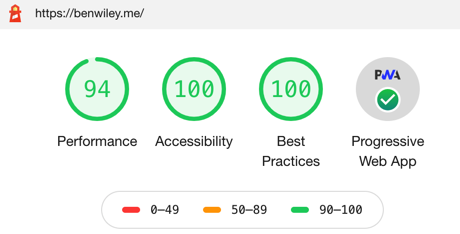

[](https://app.netlify.com/sites/benwiley/deploys)
[](https://github.com/prettier/prettier)

# Ben Wiley's Personal Website 1.0

**Special Thanks to Greg Lobinski's GatsbyJS starter template:**
[](https://github.com/greglobinski/gatsby-starter-personal-blog)

## Description

A Progressive Web Application built using GatsbyJS, ReactJS, GraphQL, and Netlify. This is my first version of my personal website aimed at highlighting my background, experience, and personal projects. Website styles, colors, and logos created by Ben Wiley.

## Google Lighthouse Scores


## Features:

- Uses **Gatsby** static site generation
- **CSS** with `styled-jsx`
- **Netlify** continuous deployment pipeline
- 100% **PWA** (manifest.webmanifest, offline support, favicons)
- App **favicons** generator (node script)
- Base **styles** via `theme` object generated from `yaml` file (fonts, colors, sizes)
- React **v.16.3** (gatsby-plugin-react-next)
- **Prettier** code styling
- Webpack `BundleAnalyzerPlugin`

## Prerequisites for Local Installation

If you do not have Gatsby Cli installed yet, do it first.

```text
npm install --global gatsby-cli
```

More information on [GatsbyJS.org](https://www.gatsbyjs.org/tutorial/part-one)

## Getting started

Install the starter using Gatsby Cli `gatsby new` command.

```text
gatsby new [NEW_SITE_DIRECTORY_FOR_YOUR_BLOG] https://github.com/greglobinski/gatsby-starter-hero-blog.git
```

Go into the newly created directory and run

```text
gatsby develop
```

to hot-serve your website on http://localhost:8000 or

```text
gatsby build
```

to create static site ready to host (/public).

##### External services

The starter uses the GitHub API to pull my repositories, their descriptions, URLs, and creation dates.

Create an `.env` file like below in the root folder. Change `...` placeholders with real data.
<br />By default, your `.env` file will be ignored by git. Remove `.env` from `.gitignore` in order to be able to push the file to your repository.

```text
GITHUB_API_KEY={Insert Key Here}
```

## Authors

- [Ben Wiley](https://github.com/BenWileyUMN)
- [Greg Lobinski](https://github.com/greglobinski) 

## Licence

MIT License

Permission is hereby granted, free of charge, to any person obtaining a copy of this software and associated documentation files (the "Software"), to deal in the Software without restriction, including without limitation the rights to use, copy, modify, merge, publish, distribute, sublicense, and/or sell
copies of the Software, and to permit persons to whom the Software is furnished to do so, subject to the following conditions:

The above copyright notice and this permission notice shall be included in all copies or substantial portions of the Software.

